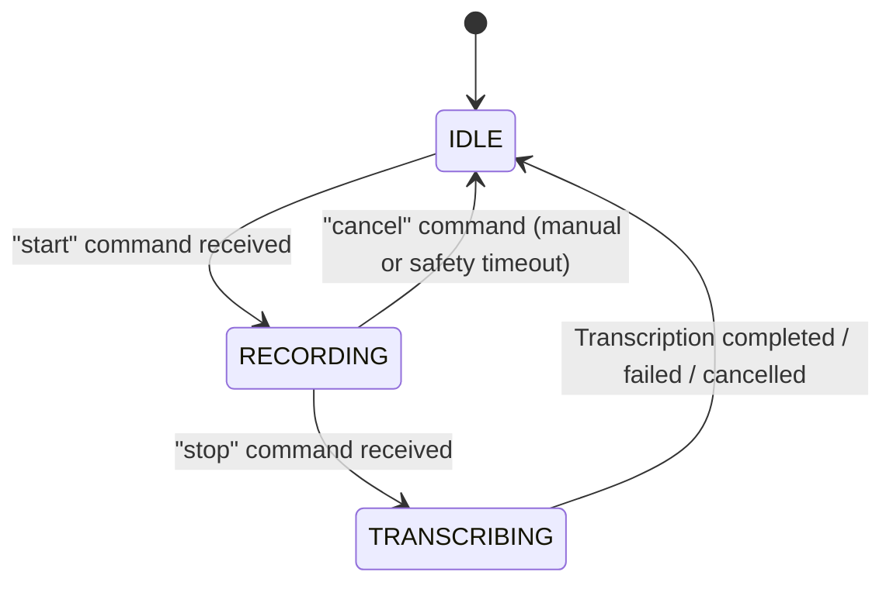
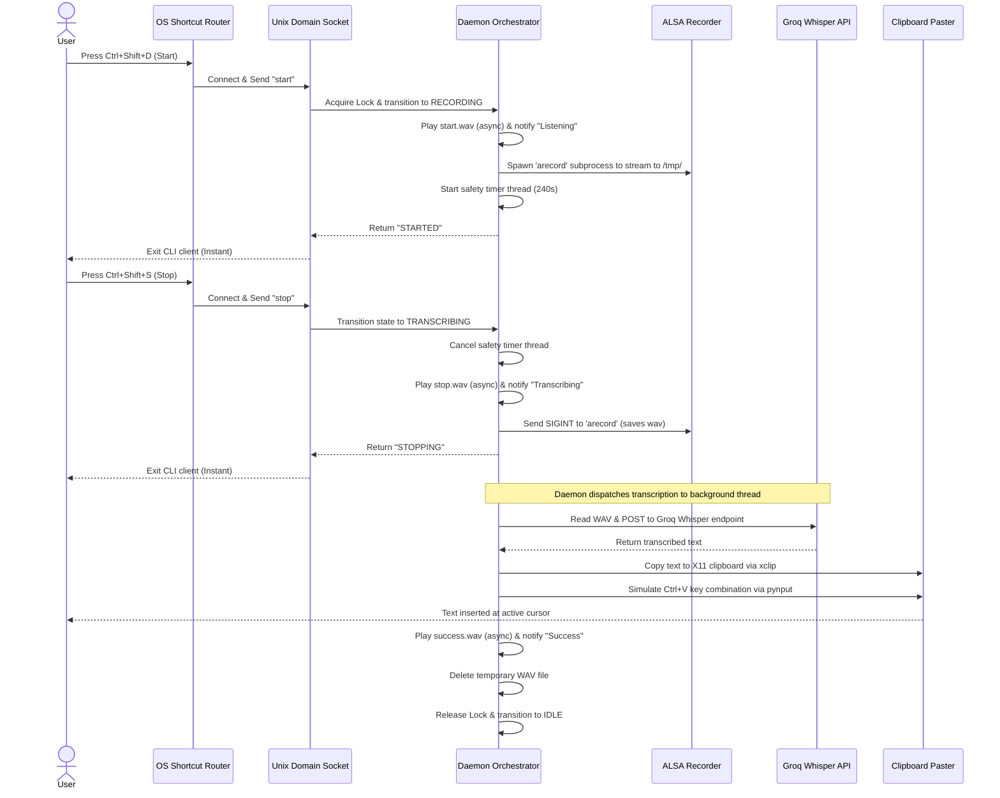

# System Architecture: PersonalSTT

PersonalSTT is built on a client-server architecture using Unix Domain Sockets for lightweight, low-latency Inter-Process Communication (IPC). The system registers a persistent background daemon via systemd, and interacts with it using a CLI wrapper triggered by global OS hotkeys.

---

## Component Architecture

```mermaid
graph TD
    subgraph Client Space (CLI)
        Hotkey[Ubuntu OS Hotkey] -->|Triggers| CLI[cli.py / main.py]
    end

    subgraph Daemon Space (Background Service)
        Socket[Unix Domain Socket Server] -->|Dispatches Command| Daemon[daemon.py]
        Daemon -->|Controls| Recorder[recorder.py]
        Daemon -->|Triggers Beeps| Sound[sound.py]
        Daemon -->|Spawns Thread| Transcriber[transcriber.py]
        Daemon -->|Pipes Output| Paster[paster.py]
    end

    subgraph OS & External Hardware
        Recorder -->|Spawns| arecord[ALSA arecord process]
        arecord -->|Writes WAV| TempDir[(/tmp/)]
        Sound -->|aplay -q| Speaker[System Speaker]
        Transcriber -->|HTTPS Request| Groq[Groq Whisper API]
        Paster -->|xclip stdin| Clipboard[X11 Clipboard]
        Paster -->|pynput Ctrl+V| ActiveWindow[Active Focused Window]
    end

    CLI -->|Socket Client| Socket
```

---

## State Machine

The daemon operates in three main states, coordinated using thread locks to prevent race conditions from concurrent key presses:



### State Definitions

- **`IDLE`**: The daemon is sleeping, waiting for connections on the Unix socket. Resource consumption is effectively zero.
- **`RECORDING`**: The ALSA `arecord` process is active, streaming microphone input to `/tmp/personalstt_recording.wav`. A safety timer thread is running.
- **`TRANSCRIBING`**: `arecord` has terminated. A background thread is communicating with the Groq API. The socket is immediately freed to accept new commands, but the daemon state remains locked in `TRANSCRIBING` to reject new recording starts until pasting is complete.

---

## Execution Lifecycle Sequence

The sequence diagram below details the thread coordination and file flow when a user starts, stops, and receives a text insertion:


